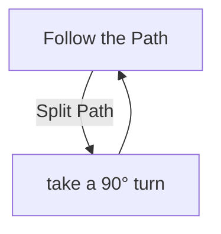

# Molten Vault

## Zone Read

:::tip Simple Read
Snakelike Linear Layout, Follow the Path knowing that it will move up and down until you reach the End.
:::

The Molten Vault is a small Layout of connected Rooms and Pathways. Currently all Variants start along the Left Edge and extends towards the Right.
There are 2 Checkpoints along the Top Edge and one at the Boss Entrance.

Continue to follow the path and take a Turn into the direction the Zone extends too whenever a split path is offered until reaching the Right Edge.

## Layouts

### Variant Table Examples

| Semi-Static Zone                                       |
| ------------------------------------------------------ |
|  |

### Points of Interest

Mektul - Unlocks 3 to 1 Reforging
