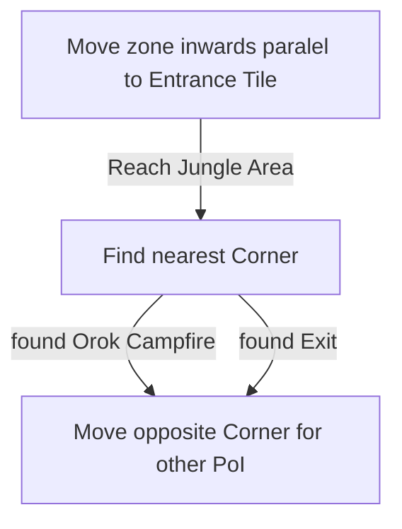
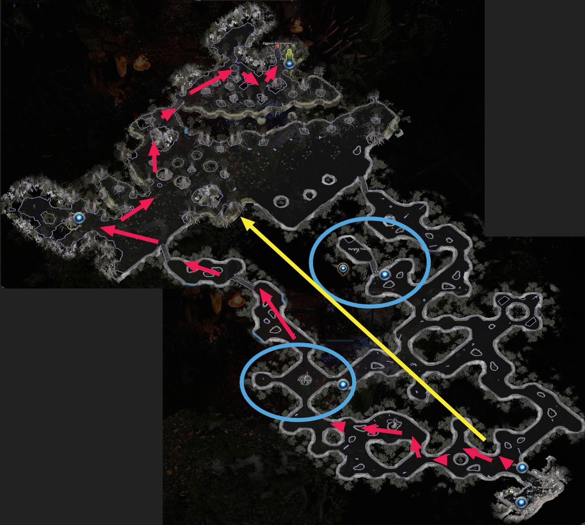

# Sandswept Marsh

## Zone Read

:::tip Simple Read
Follow Paralel to the Entrance Tile zone Inwards till you reach the Jungle Section. The Exit is in one Corner and the Orok Campfire is in the opposite Corner.
:::

Sandswept Marsh has the unique Property of having dungeon based AND tile based terrain generation. The first Pathlike Section is the Dungeon Part mimicing dungeon corridors and the second section, the sand into jungle transition section
is tile based. Noticable by its open tile terrain.

Another important Information about the Zone is, that the Orok Campfire and the Town Entrance are always in opposite Corners of the Jungle Section.
And that the Hanging Tree and Rootdredge mark the middlepoint of Dungeon Section. There is no correlation between the Midpoint PoIs and the Exit Tile.

## Layouts

### Variant Table Examples

| Example                                                      |
| ------------------------------------------------------------ |
|  |

### Points of Interest

Rootdrege - LvL 9 Skill Gem  
Hanging Tree - Random Magic Ring  
Orok Campfire - 2 Rares guarding a Rare Chest with a guranteed Lesser Jeweller Orb Drop
