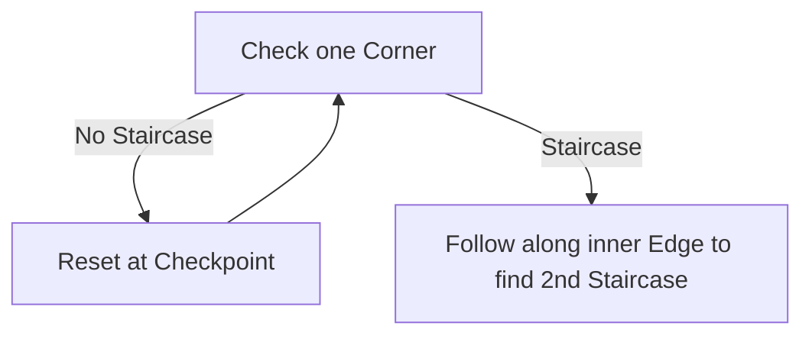

# Temple of Kopec

## Zone Read

:::tip Simple Read
Follow along the Edge till you find the Stairs to next Layer.
:::

The Temple of Kopec consist of 3 Layers with the 3rd one being the Boss Arena.  
On the first Layer the Staircase is always in a random Corner, there is no Enviromental Clue as to which one has the Staircase.
:::info Cyclon's Note
I prefer to check behind the CP first, others like to go directly through the middle.
:::

The Second Floor has the Staircase ALWAYS one the Side blocked by a Tear in the floor connecting to the Wall. The Gap is jumpable with any Movement Skill.  
Alternative move along the Inner Edge till you can move into that Corner.

## Layouts

### Variant Table Examples

| 1st FLoor                                                           | 2nd Floor                                                           |
| ------------------------------------------------------------------- | ------------------------------------------------------------------- |
| .png>) | .png>) |

### Points of Interest

Ketzuli - Unlocks Roleplay Section to activate Time Travel Portal
