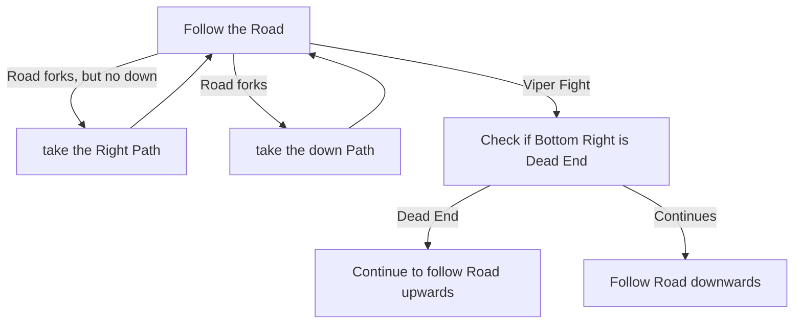

# Utzaal

## Zone Read

:::tip Simple Read
Follow the Road!
:::

Utzaal is the prime Version of Drowned City. While the rules of Drowned City can be applied here, it is way simpler to just follow the Road and take Turns towards the Ambush / Viper Arena when the Road Forks.
After the Viper Fight check if Bottom Right is a Dead End, if it isn't follow it.

## Layouts

### Variant Table Examples

| Example                                  |
| ---------------------------------------- |
| .png>) |

### Points of Interest

Viper - Blocks Passage towards next Zone
