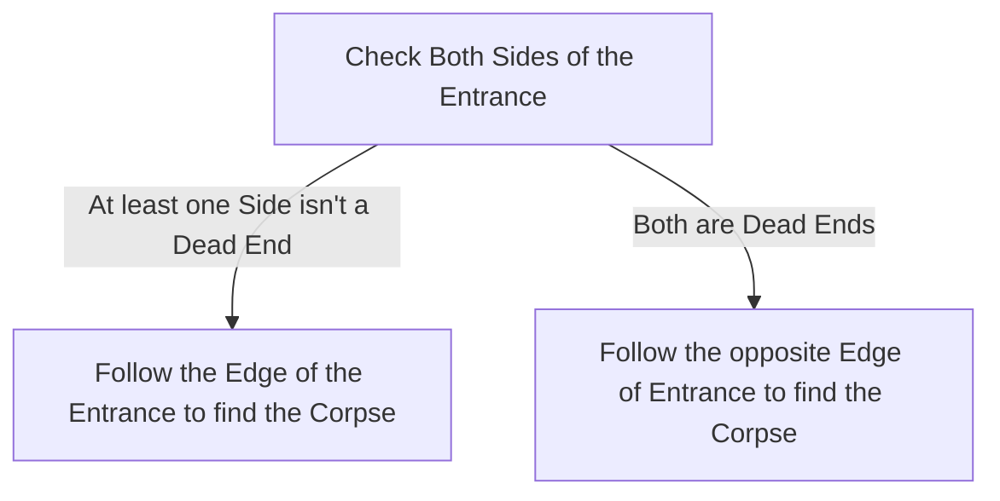

# Venom Crypts

## Zone Read

:::tip Simple Read
Follow Entrance Edge, if both Sides are Dead End, follow opposite Edge to Entrance instead.
:::

Venom Crypt is a maze like overgrown Crypta that follows roughly one rule. The Entrance and the Corpse are roughly paralel to each other.
There is no clear enviromental Tell if the Corpse is horizontal or vertical paralel to the Entrance.  
The best aproach is to follow an Edge. Luckily we can determine which Edge to follow based on how many Connections the starting Tile has.

If the Starting Tile only connects opposite to the Entrance the Entrance is on the outer Edge and the Corpse is guranteed in the Center of the Zone.
If the Starting Tile has two to three Connections, we can not determine if its on the outer Edge or inner Edge. We have to follow the Entrance Edge in either Direction until we find the Corpse.
We do know that in this case the Starting Tile and Corpse Tile are always along the same Edge.

## Layouts

### Variant Table Examples

| Example                                                            |                                                                    |
| ------------------------------------------------------------------ | ------------------------------------------------------------------ |
| .png>)   | .png>) |
| .png>) | .png>) |

### Points of Interest

Venom Drought - Side Quest Item for Permanent Buff  
Priesthood Crypta - Rare Chest guarded by Snake Type Enemies
