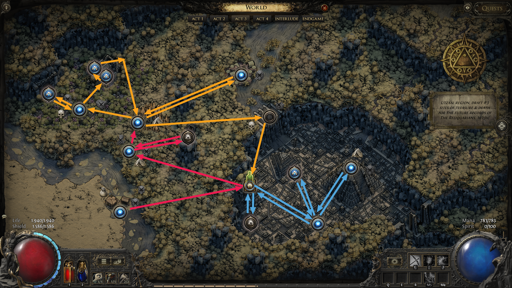
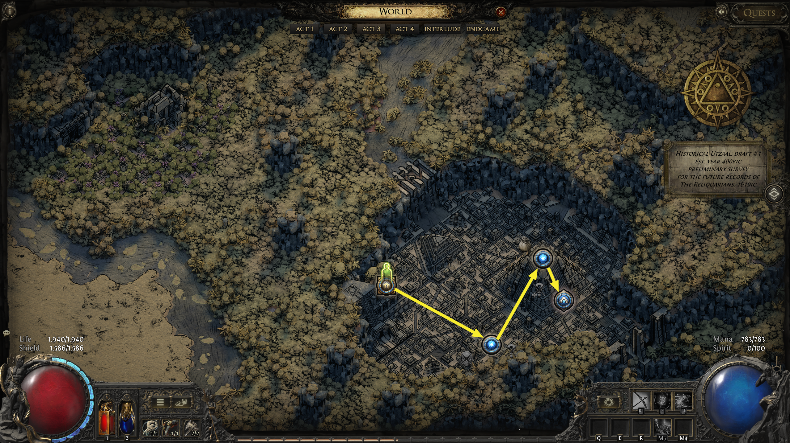
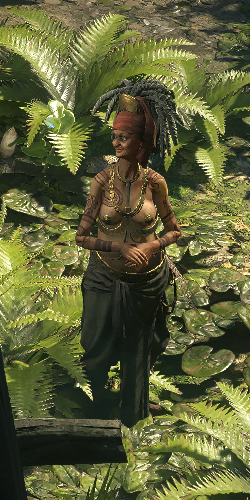
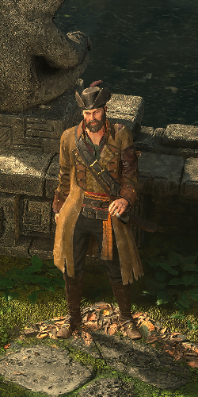
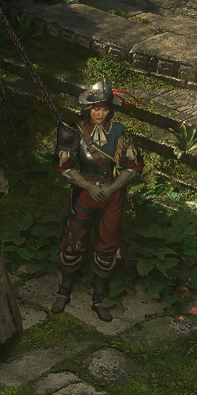
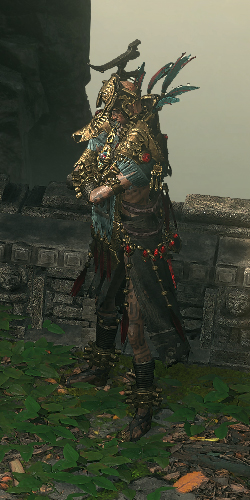

# Overview

## Video Guide

SoonTM

## Progression

| Present                                         | Past                                      |
| ----------------------------------------------- | ----------------------------------------- |
|  |  |

Act 3 Progression is Split between Past and Present. Just like in Act 1 the Progression can be split into 4 Sections.  
The  red Arrows are for the Arrival Section.  
The  orange Arrows are for the Vaal Section.  
The  blue Arrows are for the Drowned City Section.  
The  yellow Arrows are for the Past Section.

White / Black Text is required for Main Story Progression or Permanent Buffs.  
 Red Text marks Optional Tasks for additional Uncut Skill Gems or Uncut Support Gems, the Notes include the Reward.

Several Tasks in one Area can be completed in any Order, unless otherwise noted.

| Nr. | Zone                  | To-Do                                                                                 | Notes                                                                                                                                                      |
| --- | --------------------- | ------------------------------------------------------------------------------------- | ---------------------------------------------------------------------------------------------------------------------------------------------------------- |
| 1   | Sandswept Marsh       |  Kill Rootdredge                                    | Drops LvL 9 Uncut Skill Gem                                                                                                                                |
| 2   | Sandswept Marsh       |  Kill the 2 Rares at the Orok Campfire              | Rare Basket drops Lesser Jeweller's Orb                                                                                                                    |
| 3   | Sandswept Marsh       |  Interact with Cropse at Hanging Tree               | Drops Random Magic Ring                                                                                                                                    |
| 4   | Sandswept Marsh       | Enter Ziggurat Encampment                                                             |                                                                                                                                                            |
| 5   | 1st Town Visit        | Talk to Alva & Oswald. Enter Jungle Ruins                                             |                                                                                                                                                            |
| 6   | Jungle Ruins          | Kill Mighty Silverfist                                                                | +2 Weapon Set & Passive Points                                                                                                                             |
| 7   | Jungle ruins          |  Interact with the Ravaged Corpse and Summon Servi  | Servi rewards a Rare Belt                                                                                                                                  |
| 8   | Jungle Ruins          | Enter Venom Crypts                                                                    |                                                                                                                                                            |
| 9   | Venom Crypts          | Find the Serpent Priestess Corpse and Collect Corpse-snake Venom                      |                                                                                                                                                            |
| 10  | Jungle Ruins          | Enter Infested Barrens                                                                |                                                                                                                                                            |
| 11  | Infested Barrens      | Activate Waypoint                                                                     |                                                                                                                                                            |
| 12  | Infested Barrens      |  Troubled Camp                                      | Camp is attacked by 2 Rare Beasts. Great Spot to hunt for Companion. Keep 'Reset at Checkpoint', but DO NOT kill. They won't respawn if killed.            |
| 13  | Infested Barrens      | Enter Chimeral Wetlands                                                               |                                                                                                                                                            |
| 14  | Chimeral Wetlands     | Activate Waypoint then return to Infested Barrens                                     |                                                                                                                                                            |
| 15  | Infested Barrens      | Enter Azak Bog                                                                        |                                                                                                                                                            |
| 16  | Azak Bog              |  Activate the Ritual totems at the Flameskin Ritual | Ritual grants 25% Fire Resistance and 25% Item Rarity. Alternative 'Reset at Checkpoint' to farm Enemies here for Loot + Experience.                       |
| 17  | Azak Bog              | Kill Ignadgduk and Collect Gemrot Skull + Ignaduk's Ghastly Spear                     | +30 Spirit and LvL 10 Uncut Skill Gem                                                                                                                      |
| 18  | 2nd Town Visit        | Talk to Servi then WP to Chimeral Wetlands                                            | Servi rewards Permanent Buff for Snake Venom and Ailment Charm for Ghastly Spear                                                                           |
| 19  | Chimeral Wetlands     |  Loot Chest in Ravaged Camp                         | The Camp contains 2 Magic and 1 Rare Chest                                                                                                                 |
| 20  | Chimeral Wetlands     | Enter Temple of Chaos                                                                 |                                                                                                                                                            |
| 21  | Temple of Chaos       | Activate Waypoint then return to Chimeral Wetlands                                    |                                                                                                                                                            |
| 22  | Chimeral Wetlands     | Kill Xyclucian, the Chimera then enter Jiquani's Machinarium                          | Drops a Inscribed Ultimatum and LvL 9 Uncut Skill Gem                                                                                                      |
| 23  | Jiquani's Machinarium | Kill Blackjaw, the Remnant                                                            | +10% Fire Resistance Perm. Buff                                                                                                                            |
| 24  | Jiquani's Machinarium |  Loot Chest in Supply Room                          | Supply Room contains 3 Rare Chests. Requires an additional Small Soul Core                                                                                 |
| 25  | Jiquani's Machinarium | Enter Jiquani's Sanctum                                                               | You need a Total of 3 Small Soul Cores. 1 in the First Section, 2 in the Second. 1 for Progression and 1 for Blackjaw Side Room                            |
| 26  | Jiquani's Sanctum     | Find 2 Medium Soul Cores and activate Generators                                      | After activating 2nd Generator. Checkpoint to Boss Room. Then activate Checkpoint and 'Reset at Checkpoint' to skip waiting for Energy to reach Boss Room. |
| 27  | Jiquani's Sanctum     | Kill Zicoatl, Warden of the Core and Collect Large Soul Core                          | Drops Large Soul Core and LvL 10 Uncut Skill Gem                                                                                                           |
| 28  | Jiquani's Sanctum     | WP to Infested Barrens                                                                |                                                                                                                                                            |
| 29  | Infested Barrens      | Place Large Soul Core and Enter Matlan Waterways                                      |                                                                                                                                                            |
| 30  | Matlan Waterways      | Activate Canal Lever then Portal to Town                                              | Portal first next to Lever. Then Activate Lever. Spam Click Portal as Animation Ends to leave Zone before Map opens                                        |
| 31  | 3rd Town Visit        | Walk down the Stairs, talk to Alva, then enter Drowned City                           |                                                                                                                                                            |
| 32  | Drowned City          | Activate Waypoint                                                                     |                                                                                                                                                            |
| 33  | Drowned City          | Find Entrance to Molten Vault, Summon + Talk to Oswald, then Enter Molten Vault       |                                                                                                                                                            |
| 34  | Molten Vault          | Kill Mektul, the Forgemaster. Collect Hammer of Kamasa.                               |                                                                                                                                                            |
| 35  | Molten Vault          | Checkpoint to Entrance, then return to Drowned City                                   |                                                                                                                                                            |
| 36  | Drowned City          | Enter Apex of Filth                                                                   |                                                                                                                                                            |
| 37  | Apex of Filth         | Kill Queen of Filth and Collect Temple Door Idol                                      |                                                                                                                                                            |
| 38  | Apex of Filth         | Checkpoint to Waypoint, then WP to Drowned City                                       |                                                                                                                                                            |
| 39  | Drowned City          | Enter Town                                                                            | Returning to Town via Waypoint in Drowned City is faster than walking down the Stairs                                                                      |
| 40  | 4th Town Visit        | Place Temple Door Idol and enter Temple of Kopec                                      |                                                                                                                                                            |
| 41  | Tempel of Kopec       | Kill Ketzuli, High Pirest of the Sun                                                  | Drops LvL 11 Skill Gem. Portal                                                                                                                             |
| 42  | Temple of Kopec       | Summon Alva, Place Portal. 'Interact' Dialog Option                                   | Leave via Portal once the Platform starts moving and Quest State updates                                                                                   |
| 43  | 5th Town Visit        | Enter Gateway, then Enter Utzaal                                                      |                                                                                                                                                            |
| 44  | Utzaal                | Kill Viper Napuiatzi                                                                  | Drops LvL 3 Uncut Support Gem and LvL 11 Uncut Skill Gem                                                                                                   |
| 45  | Utzaal                | Enter Aggorat                                                                         |                                                                                                                                                            |
| 45  | Aggorat               | Collect the Sacrifical Heart (Drops from Vaal Goliaths in Utzaal and Aggorat)         | This might take several 'Reset at Checkpoint'. Best done at the Middle Checkpoint                                                                          |
| 45  | Aggorat               | Place Heart and Sacrifical Dagger at Sacrificial Altar                                | +2 Weapon Set & Passive Points                                                                                                                             |
| 45  | Aggorat               | Enter Black Chambers                                                                  |                                                                                                                                                            |
| 46  | Black Chambers        | Kill Doryani, Royal Thaumaturge                                                       |
| 47  | 6th Town Visit        | Talk to Doryani in Past. Talk to Alva to Leave to Act 4                               |

## Town NPCs

| Servi                                                | Oswald                                     | Alva                                   | Hooded One                                                 | Doryani                                      |
| ---------------------------------------------------- | ------------------------------------------ | -------------------------------------- | ---------------------------------------------------------- | -------------------------------------------- |
|              |  |  |      |  |
| Servi sells Wands,Sceptres,Foci, Jewellery & Flasks. | Oswald sells Armour & Weapons.             | Alva offers Gambling.                  | The Hooded One allows Respecilisation and Identifies Items | Allows Travel to Act 4                       |
|                                                      |                                            |                                        |                                                            | Unlocks after defeating him in the Past      |
