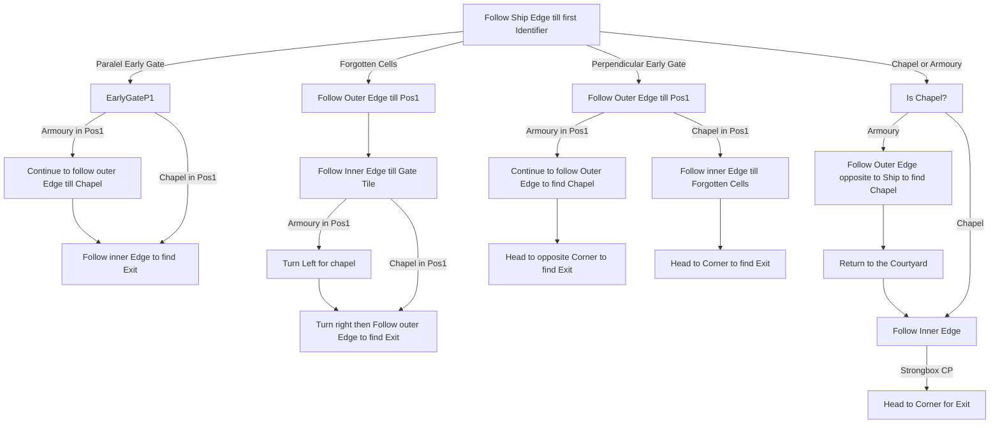

# Abandoned Prison

## Zone Read

:::tip Simple Read
Follow the Outer Edge from the Ship Side of the Walkway.
:::

Abandonded Prison has 4 Layouts that can be determined based on the Position and orientation of specific Tiles.
Important is the Prison Gate Tile and the Forgotten Cells tile.

Each Layout has 2 subvariants where the Position of the Armoury and Chapel are swapped.

The Solution for reading the Zone was created by GuythatDies and the Images have been yoinked from Lailoken. The Graph below is adjusted for 100% Campaign Runs for League Start Purposes.

## Layouts

### Variant Table Examples

|                                                                                                         |                                                                                                       |
| ------------------------------------------------------------------------------------------------------- | ----------------------------------------------------------------------------------------------------- |
| Early Paralel Gate.png>)       | Early Forgotten Cells .png>) |
| Early Perpendicular Gate.png>) | Late Gate & Cell .png>)      |

### Points of Interest

Chapel - Permanent Buff 30% Increased Mana or Life Recovery from Flask  
Forgotten Cells - No Special Reward but required for Layout Identifying  
Armoury - Several 'Chests' of different Rarity dropping Weapons guarded by Rare Fallen Quartermaster  
Strongbox - Long Hallway with guranteed Strongbox
