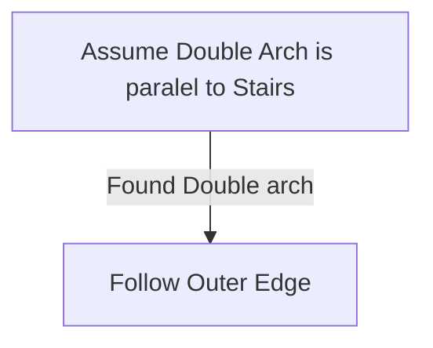

# Arastas

## Zone Read

:::tip Simple Read
Follow the Outer Edge of the Zone
:::

Arastas is blocked at the Entrance until you have collected the 3 Weapon Pieces.

Arastas is a longwinded Linear Zone with a Town Maze Section at the Start. The Cliff Section of the Zone starts at the Double Arch, from there just follow the Outer Edge.
To get through the Town Section efficiently assume that the Double Arch is roughly paralel to the Stairs leading into the Town from the Harbour.

The zone has 2 Bells paralel to each other dropping 3 Exalted and 3 Regal Orbs. The Bells are always in the first part of the Cliff Section near the Town. When following the Outer Edge the Bell is forced onto you.

The Torvian Bossfight is a 'gimmic' Fight. The Boss does a charged Throw Attack which can hit his Buffers, when positioning infront of their Platforms.

- Faith Buffer grants Stun and Ailment Immunity
- Shield Buffer grants Improved Defense and cast Wall of Shields inflicting Holy Vengeance (Slow and increased Critical Hit Chance taken)
- Sword Buffer Empowers Torvian granting Shock, Chill, Ignite and Freeze on all Hits
  Torvian also has a forced Immunity Phase at Low Life.

## Layouts

### Variant Table Examples

| Example                                       |
| --------------------------------------------- |
| .png>) |

### Points of Interest

Morning Bell - Drops 3 Regal Orbs  
Evening Bell - Drops 3 Exalted Orbs  
Excavated Pit - Torvian, Hand of the Saviour drops LvL 12 Skill Gem and unlocks Path to Excavation
