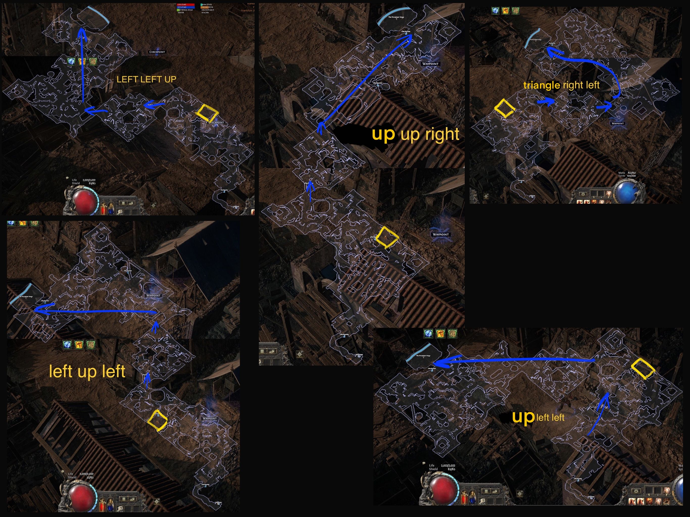

# Excavation

## Zone Read

:::tip Simple Read
Move into the opposite Corner from Entrance. If Dead End bounce of and move into adjacent corner. Go through the Middle Square and repeat for the Final Section. Seek opposite Corner if dead End find adjacent.
:::

Excavation consist of 3 Sections 2 Large Rectengular ones and one Diamond or Square Shaped in the Middle. The Entrance to the Middle Section from the first is always in the opposite Corner of the Rectangle to the Entrance. The Exit in the middle Section is also always opposite. The Boss Arena in the Last Section is across either Edge of the Opposite Corner to the Entrance.

The Algorithm is from REEEHEEE from the Campaign Codex Discord. [Visit the Discord for the full Explanation](https://discord.gg/Jdd8589DBy)  
TL;DR:
Start by going left/up whenever possible.  
At the diamond hub, the rule is simple: in ~95% of runs, leave it in the opposite direction you entered from (right in → left/up, left in → right/up), since the boss is almost always above the diamond.  
In the remaining ~5%, the boss is horizontally aligned with the diamond so if you entered from the right, go far right and if you entered from the left, go far left.

TL;DR²:
• Start: left/up if possible. If not → right.  
• Diamond: exit opposite side you entered (~95% boss hit).  
• Rare ~5%: boss horizontal → enter right → far right, enter left → far left.

## Layouts

### Variant Table Examples

| Visual Graphic from anotherHour (also Campaign Codex Discord) |
| ------------------------------------------------------------- |
|                      |

### Points of Interest

Excavated Cache - Rare Chest
Shrine - Random Shrine
Precursor Forge - Benedictus, First Herald of Utopia, main quest Progression.
