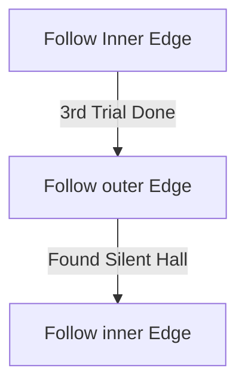

# Eye of Hinekora

## Zone Read

:::tip Simple Read
Static Cross Shaped Zone. Follow Inner Edge, with Exception after 3rd Trial. Silent Hall at the Outer Edge.
:::

Eye of Hinekora has only 1 Variant and is a forced Static Layout. Only very minor differences in the Pathhing between the Trials.
After the 2nd Trial along the force Path is a Waterfall, inside is a Rare chest and the Silent Hall is always after the 3rd Trial along the Outer Edge.

## Layouts

### Variant Table Example

| Static Layout                                                         |
| --------------------------------------------------------------------- |
| .png>) |

### Points of Interest

Navali's Gift - Silent Hall at the End is Navali's Body. Paying Respect rewards permanent 5% increased Maximum Mana  
Shrouded Falls - Rare Chest behind Waterfall after 2nd Trial drops LvL 12 Spirit Gem
