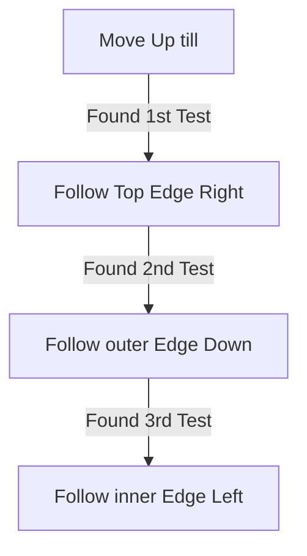

# Halls of the Dead

## Zone Read

:::tip Simple Read
Follow the Outer Edge
:::

Halls of the Dead is a Static Layout with fixed Positions for all Point of Interest in the 4 Corners of the Zone.

## Layouts

### Variant Table Examples

| Static Layout                                                                           |
| --------------------------------------------------------------------------------------- |
| .png>) |

### Points of Interest

Yama's Test - Yama the White drops Silver Coin and unlocks Path to Trial of the Ancestors. Silver Coin can be handed in for a Tattoo in TotA for +2 Weapon Set & Passive Points  
Tawhoa's Test - Reward either +5 Dexterity or +5% Lightning Resistance
Tasalio's Test - Rewards either +5 Intelligence or +5% Cold Resistance
Ngamahu's Test - Rewards either +5 Strength or +5% Fire Resistance
