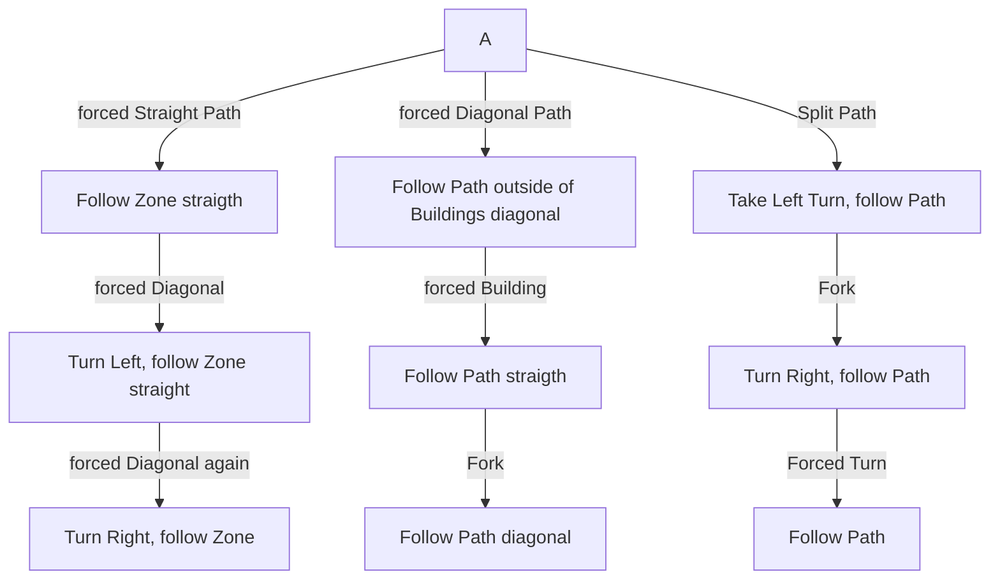

# Heart of the Tribe

## Zone Read

:::tip Simple Read
Follow the Zone. Checkpoints are always at Dead Ends.
:::

Heart of the Tribe is the final Zone in Act 4. It has 3 Variants that can be determined by the inital path.
The Zone has several Dead End Paths that are always indicated by a Checkpoint near the Fork. The optimal Path has no Checkpoints except the first and final one.
Only enter Buildings when forced to, stay outside of buildings whenever possible.

Images are from GuyThatDies from Campaign Codex Discord, pathing is based on his Images

## Layouts

### Variant Table Examples

| Variants                                                                            |
| ----------------------------------------------------------------------------------- |
|  |
|  |
|  |

### Points of Interest

Meeting House - Contains some Rare and Magic Chest  
Campfire - Contains some Rare and Magic Chest  
Farm Field - Nothing Notable  
Sacred Interior - Tavakai, the Chieftain Boss Fight
