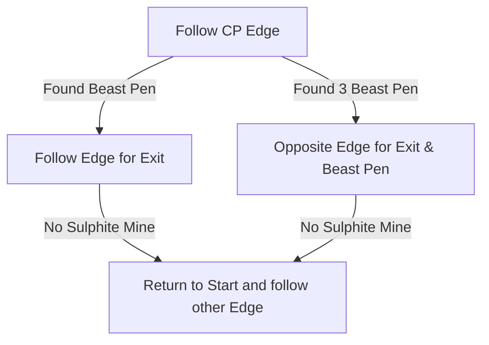

# Isle of Kin

## Zone Read

:::tip Simple Read
Follow Checkpoint Edge. The Exit is alays on the Opposite End of the Zone to the Entrance
:::

Volcanic Warrens can be disected into 2 Sections each containing a couple Point of Interest. The Exit and the Primal Arena are always located at the opposite Edge to the Entrance.
The first Section of the Map has Suplhite Veins on the Ground, while the Second contains raised Rocks instead of Sulphite Veins on the Ground.

In the first Section you can find the Abandonded Delving Site, the Sulphite Spire and a Torn Map Piece.

The 2 Beast Pens, one Set of 3 smaller ones and one containing a Rare Miniboss are right after the Chockepoint starting the 2nd Section. Notably on all known Variants the Beast Pen with the Miniboss is always on the same Vertical Side of the Zone as the Exit.

## Layouts

### Variant Table Examples

| Example                                   |
| ----------------------------------------- |
| .png>) |

### Points of Interest

Primal Arena - Blind Beast drops Blank Greater Rune  
Beast Pen - Mimbok, the Enslaved Rare Subdued Behemoth drops LvL 4 Support Gem & LvL 12 Skill Gem
Abandonded Delving Site - Rare Fossiled Formation drops Lesser Jeweller Orb  
Wrecked Boat - Flayed Sailor interactible Object drops Torn Map Piece  
Voltaxic Spire - Interactible Object grants Suplite Intoxication: 10% Movement Speed, 15% All Resistances and 30% Damage as Extra Lightning for the Zone  