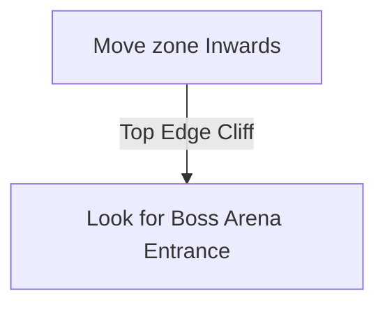

# Journey's End

## Zone Read

:::tip Simple Read
Follow the Waypoint Waterside Edge
:::

Journey's End is a large somewhat linear Zone. Just like Kedge Bay it has a Waterside Edge, visual a Steep drop Cliff, and a Inland Edge visual Rocks and Broken Ship Pieces.
The Waypoint is always on the Waterside Edge of the Zone and following that Edge will lead to a trapped Ship at the Halfway Point of the Zone.
With some Experience it is faster to walk straight into the Zone instead of following a Edge.

## Layouts

### Variant Table Examples

| Example                                                      |
| ------------------------------------------------------------ |
| .png>) |

### Points of Interest

Freya Hartlin - Starts Delirium Encounter once freed. Touching the Fracturing Mirrors spawns more Monsters. Omniphobia drops several Liquid Emotions and rewards +2 Weapon Set & Passive Point in Town  
Booby-trapped Boat - Rare Chest on Boat, upon Opening more Chest, Gold Piles and Timer. Boat will explode at the End of Timer, creating unwalkable Terrain and killing any PLayer on the Boat  
Captain's Chair - Captain Hartlin drops Verisium for Dark Mist Side-Questline
