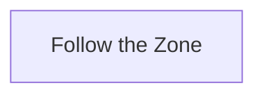

# Kedge Bay

## Zone Read

:::tip Simple Read
Follow the Zone
:::

Kedge Bay is a long Linear Zone with slight Variations on the Curves and Point of Interest Tile Sets. You cannot get lost by simply following the Zone.

The Point of Interest don't drop anything Noteworthy outside the Torn Map Piece and are all along the Path.

## Layouts

### Variant Table Examples

| Example                                                 |
| ------------------------------------------------------- |
| .png>) |

### Points of Interest

Smuggler's Stash - Dead Man's Chest drops Torn Map Piece and nearby Cave with Gold
Tidal Cay - Rare Bloated Ancorhman with no guranteed Drops
Abandoned Ship - Rare chest and Gold Piles, spawns a Pack of Enemies when aproaching
