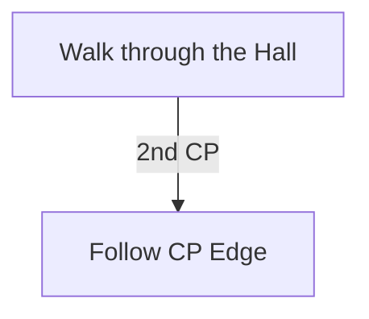

# Ngakanu

## Zone Read

:::tip Simple Read
Follow 2nd Checkpoint Edge
:::

Ngakanu is blocked at the Hall until getting the Queststate in Excavation, which is blocked until collecting the 3 Weapon Pieces.

Ngakanu is a somewhat Linear Zone with a mazelike Village. However the Path along the Edges is almost always clear. Thus it is highly recommended to just stick to the outside Edges.
The zone has 4 Layout Variants and in 3 of the 4 it is equaly long or slightly shorter to stick to the Checkpoint Edge after the Hall. You do miss out on all Point of Interest by not checking the Center though.

## Layouts

### Variant Table Examples

| Example                                       |
| --------------------------------------------- |
| .png>) |

### Points of Interest

Medicine Circle - Rare Blood-fevered Brew-breather guarding Kaimana. Upon death Kaimana grants Blood Salve Buff  
Mad Butcher - Forced Rare Miniboss at Zone Entrance drops LvL 13 Spirit Gem  
Beast Pens - Several Magic Blood-fevered Tuskbeasts, no guranteed Drop  
Abyss - A repeatable Abyss  
League Mechanic - The current League Mechanic rewards gurantees a Greater Jeweller Orb
