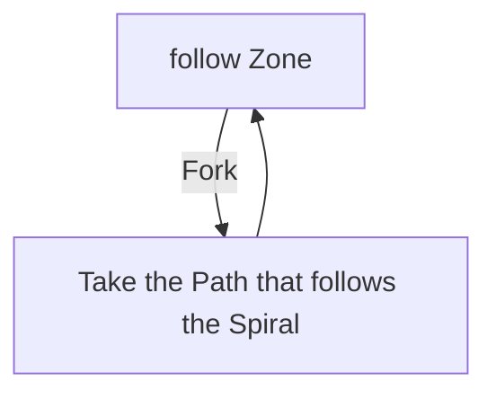

# Shrike Island

## Zone Read

:::tip Simple Read
Shrike island is always Spiral Shaped, either clockwise or counterclockwise. Follow the Zone and at Forks take the Path that continues the Spiral.
:::

Shrike Island is a long linear Zone forced into a inwards Spiral Shape. Split Paths either lead to a quick Dead End or a long and a short Path that connect back together. About 30% into the Zone the rough Shape of the Zone can be identified, which helps
choosing the better path at Forks. Always move Spiral inwards.

There are a couple Point of Interest in this Zone along the Main Path always next to a checkpoint.

:::info Cyclon's Note
Shrike Island contains many Blue Packs and a guranteed Shrine, it is a great Zone to catch up in Exp.
:::

## Layouts

### Variant Table Examples

| Example                                                             |
| ------------------------------------------------------------------- |
| .png>) |

### Points of Interest

Corpse Nest - Torn Map Piece  
Impaled Karui - Rare Jade Club or Rare Totemic Greatclub with Quality  
Shrine - Random Shrine (If it is a Damage Shrine, wait till you get to the Boss Arena then return to collect)  
Corrupted Nests - Scourge of the Skies drops LvL 11-12 Spirit Gem and progresses Main Quest or Unlocks Eye of Hinekora
