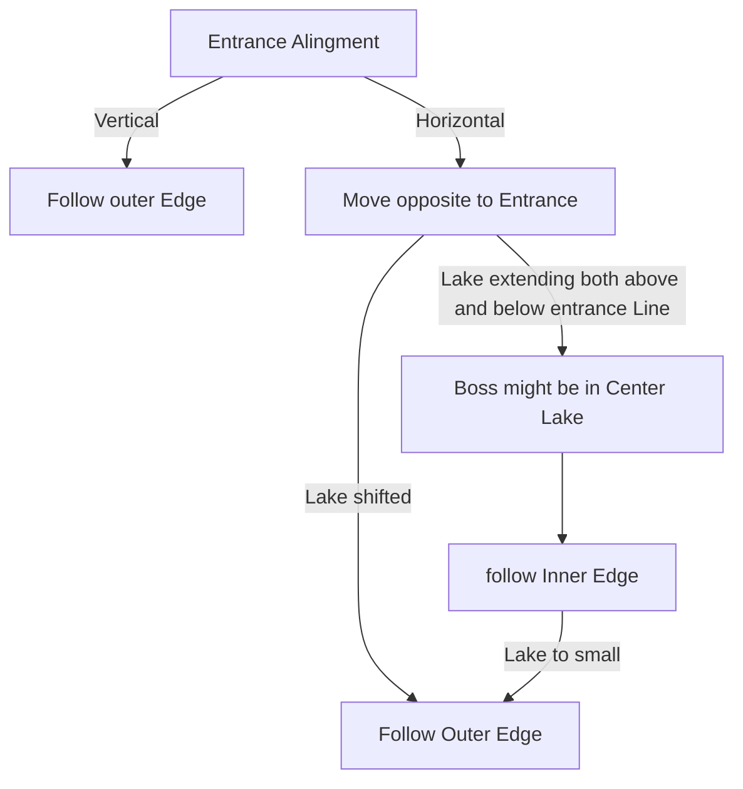

# Singing Caverns

## Zone Read

:::tip Simple Read
Follow Either Outer Edge. On Horizontal Entrances also check Center opposite to Entrance.
:::

Singing Cavern is a pleasant small Zone with 2 PoI and a Boss Fight. The Entrance is either Vertical or Horizontal. The Zone is one big circle Around a Lake. It can be split into 3 Sections.
The Entrance is always the middle of the first 2 Sections and the Boss Entrance is always in the Third Section opposite to the Entrance.

In Horizontal Layouts the Boss Fight **can** be inside the Center Lake paralel to the Entrance.
This is only possible if the Lake is paralel to the Entrance and the Center Lake is big enough. If the Lake is shifted or is to small, the Boss is in the Outer Edge.

In Vertical Layouts the Boss is always along the Outer Edge.

The Beckoning Clam and Egg Cave are in random positions along the Outer Edge. In theory those could be pinpointed by identifying the Layout Variant, there are only 4, but given the small and simplistic nature of the zone it is recommended to just force it when requiring a Amulet Upgrade and otherwise just focusing on Boss which is easily found.

- The Beckoning Clam is shaped similar to a Mermaid Tail with a long Pathway before the Checkpoint
- While the Egg Cave CP is directly along the outer Edge Path

## Layouts

### Variant Table Examples

| Vertical                                                                                                    | Horizontal                                                                                                                                            |
| ----------------------------------------------------------------------------------------------------------- | ----------------------------------------------------------------------------------------------------------------------------------------------------- |
| Boss always outer Edge in Vertical.png>) | Big Lake with Center Boss.png>)                                                  |
|                                                                                                             | Small Lake, direct at Entrance, Boss outer Edge (Image from Crimson Cast) .png>) |

### Points of Interest

Beckoning Clam - Ambush Event, drops Humming Pearl, Quest Reward for Pearlescent Amulet  
Egg Cave - Rare Brine Miaden, one random Egg contains LvL 4 Support Gem
