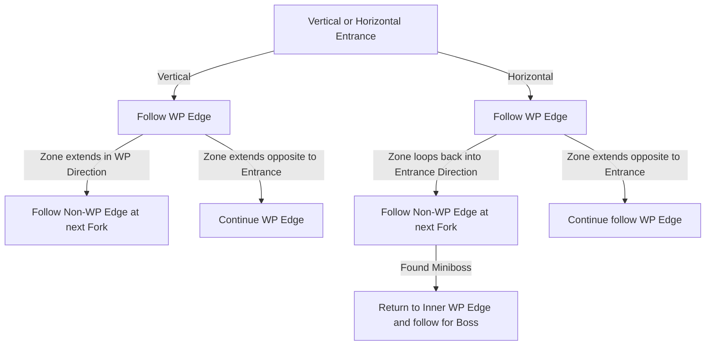

# Volcanic Warrens

## Zone Read

:::tip Simple Read
Follow the Waypoint Edge if Zone extends opposite to Entrance and follow Non-WP Edge if Zone extends into direction of Waypoint
:::

Volcanic Warrens is a Semi-Static Layout where each VAriant has distinct Positions for all Points of Interest. Based on the Entrance Alignment and the Direction the Zone extends to it is possible
to determine which Variant it is.

The Zone has 2 Horizontal Entrance Variants and 2 Vertical Entrance Variants. The Zone also contains a Miniboss Fight which rewards a Fire Qualitied Ruby Ring or a Lightning Qualitied Topaz Ring and a Shrine Encounter. The semi-optimized Pathing includes the Miniboss Fight, but not the Shrine.

Images taken from FireMCG from Campaign Codex Discord, big Props to him!

## Layouts

### Variant Table Examples

| Vertical Entrance                                                              | Horizontal Entrance                                                            |
| ------------------------------------------------------------------------------ | ------------------------------------------------------------------------------ |
| .png>) | .png>) |
| .png>) | .png>) |

### Points of Interest

Tyrant's Throne - Krutog, Lord of Kin progresses Main Quest or Unlocks Eye of Hinekora  
Volcanic Nest - 2 Rare Volcanic Golem Miniboss, Magmanore, the Molten and Sulphirox , the Voltaxic. Killing the respective Boss First gurantees a Ring of the same Element with 10% Quality and 1 guranteed Mod of same Element  
Shrine Room - Shrine surrounded by normal Enemies
