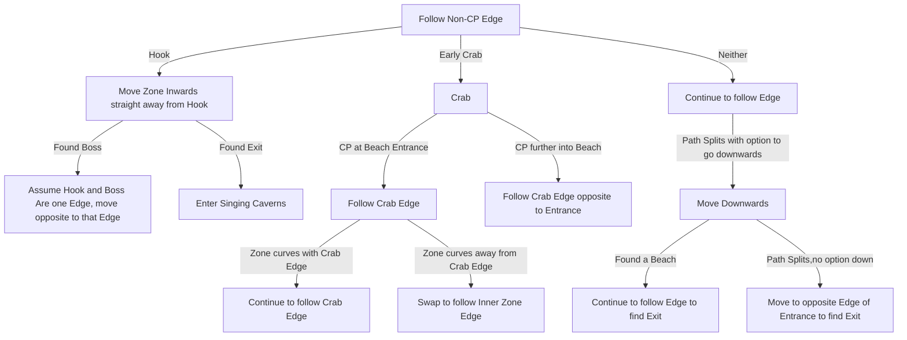

# Whakapanu Island

## Zone Read

:::tip Simple Read
Follow the Non-Checkpoint Edge
:::

Whakapanu is a solved Zone with 8 Layouts. It is the Red Vale of Act 4 and has distinct indicators or their lack as a indicator to solve which variant it is.
The Zone contains 4 Point of Interest or Enviromental Tells that Matter for the Zone Read

- Hook or Claw Shaped Beach Tile near the Entrance
- Crabshell Cavern if apearing near the Entrance
- Square Corner
- Shark Pit for one specific Layout

Each Indicator can be found by following the Non-CP Edge until you either find one or find the Exit. To fully understand the Zone Reads some amount of Practice Run is required.

In most layout variants the different Point of Interest are interchangable and they are not included in the Zone Read.
For the Neither Layouts keep in Mind rotating and mirroring Layouts exist. The term Down is used due to lack of explanation otherwise. The Down is defined as the direction opposite to the Initial movement zone inwards along the non-cp edge.

Layout Images yoinked from Arko from Campaign Codex Discord and Zone Read based on Lundburgerrs. Big Props to those two!

## Layouts

### Variant Table Examples

| Straigth Walk Layouts                                                                                                            | U Turn Layouts                                                                                                                                                                       | S Pathing Layouts                                                                                                                                                                         |
| -------------------------------------------------------------------------------------------------------------------------------- | ------------------------------------------------------------------------------------------------------------------------------------------------------------------------------------ | ----------------------------------------------------------------------------------------------------------------------------------------------------------------------------------------- |
| Hook with Exit opposite.png>)                            | Just follow Non-CP Edge .png>)                                                                               | Starts like U Layouts, but long Down Pathing. move opposite to Entrance when reaching Beach.png>)                 |
| Early Crab with Late CP, Exit opposite to Entrance.png>) | Early Crab U Rotation along the Crab Edge, just follow Non-CP Edge.png>)                                     | Starts like U Turn, but Down PAthing Ends early, forced to move Opposite to Entrance. Exit at Opposite Edge.png>) |
|                                                                                                                                  | Early Crab, but U Rotation opposite to Crab Edge, once noticed find inner Edge and follow to find Exit.png>) |
|                                                                                                                                  | Hook, but Boss Room opposite and Exit South of Boss .png>)                                                   |

### Points of Interest

Shark Pit - Great White One drops Shark Fin, which can be handed in for a LvL 4 Support Gem or LvL 11 Skill / Spirit Gem  
Crabshell Cavern - Rare Miniboss CLawcrunch drops LvL 4 Support Gem  
Petrified Pirate - Interactiable Object drops Torn Map Piece
