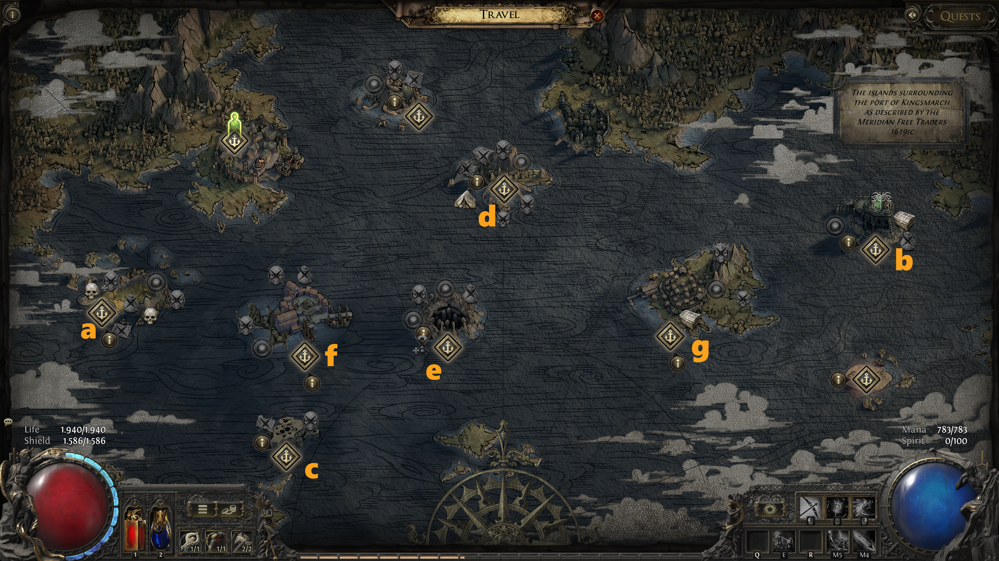
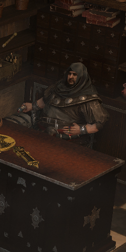
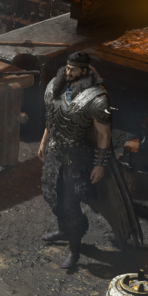
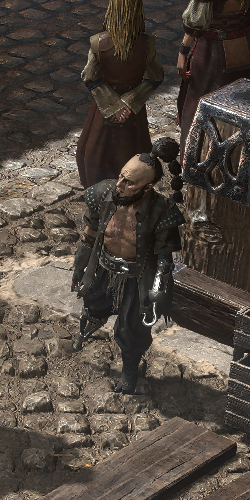
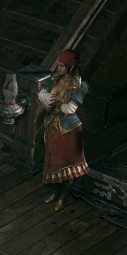
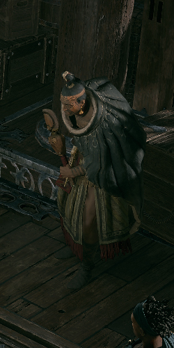
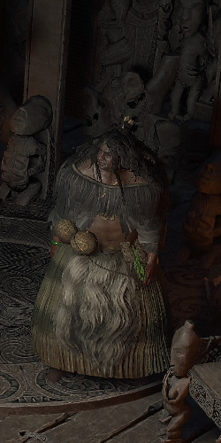
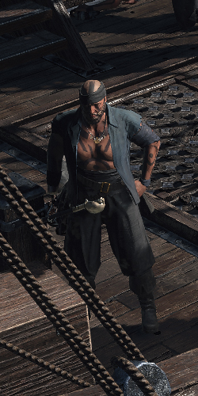

# Overview

## Video Guide

SoonTM

## Progression

Act 5 contains a Lot of Setting Sail with the Boat, to not confuse with the Numbering of the Progression I opted for Letters for the Order of Travel Points we take.:  
a. Isle of Kin  
b. Abandoned Prison  
c. Shrike Island  
d. Whakapanu Island  
e. Eye of Hinekora
f. Arastas  
g. Ngakanu

One Major upside of Boat Travelling is, that we only need to enter Town thrice.

White / Black Text is required for Main Story Progression or Permanent Buffs.  
 Red Text marks Optional Tasks for additional Uncut Skill Gems or Uncut Support Gems, the Notes include the Reward.

Several Tasks in one Area can be completed in any Order, unless otherwise noted.

| Nr. | Zone                   | To-Do                                                                                       | Notes                                                                                                                                |
| --- | ---------------------- | ------------------------------------------------------------------------------------------- | ------------------------------------------------------------------------------------------------------------------------------------ |
| 1   | 1st Town Visit         | Talk to Doryani, then Talk to Alva, take Boat Charter                                       |                                                                                                                                      |
| 2   | 1st Town Visit         | Talk to Makoru. Set Sail to Isle of Kin                                                     |                                                                                                                                      |
| 3   | Isle of Kin            | Kill the Blind Beast                                                                        | +2 Weapon Set & Passive Points                                                                                                       |
| 4   | Isle of Kin            |  open Rare Fossilised Formation                           | Drops a Lesser Jeweller ORb                                                                                                          |
| 5   | Isle of Kin            |  Kill Rare Subdued Behemoth at Beast Pen                  | Drops a LvL 4 Uncut Support Gem and LvL 12 Uncut Skill Gem                                                                           |
| 6   | Isle of Kin            | Enter Volcanic Warrens                                                                      |                                                                                                                                      |
| 7   | Volcanic Warrens       |  Kill Rares in Volcanic Nest                              | Drops a 10% Quality Rare Ruby or Topaz Ring based on Rare killed Last                                                                |
| 8   | Volcanic Warrens       | Kill Kurotg Lord of Kin                                                                     |                                                                                                                                      |
| 9   | Volcanic Warrens       | Talk to Matiki and return to Boat. Set Sail to Abandoned Prison                             |                                                                                                                                      |
| 10  | Abandoned Prison       | Collect Chapel Key and unlock Chapel. Kill all Enemies inside (Key drops from random Enemy) | Permanent 30% Mana or Life Flask Recovery                                                                                            |
| 11  | Abandondend Prison     | Enter Solitary Confinement                                                                  |                                                                                                                                      |
| 12  | Solitary Confinement   |  Loot Chests in Wardens Chamber                           | Wardens Chamber contains a Rare and Magic Chest                                                                                      |
| 13  | Solitary Confinement   | Kill the Prisoner                                                                           |                                                                                                                                      |
| 14  | Solitary Confinement   | Talk to the Hodded One and Return to Ship. Set Sail to Shrike Island                        |                                                                                                                                      |
| 15  | Shrike Island          |  Loot Impaled Karui                                       | Drops a Rare Jade CLub with Quality                                                                                                  |
| 16  | Shrike Island          | Kill the Scourge of the Skies                                                               | Drops a LvL 12 Uncut Spirit Gem                                                                                                      |
| 17  | Shrike Island          | Talk to the Hodded One and Return to Ship. Set Sail to Whakapanu Island                     |                                                                                                                                      |
| 18  | Whakapanu Island       |  Kill the Great White One                                 | Sharkfin can be handed in at final Town Visit for a LvL 11 Gem or LvL 4 Support Gem                                                  |
| 19  | Whakapanu Island       |  Kill Rare Crab at Crabshell Cavern                       | Drops a LvL 4 Uncut Support Gem                                                                                                      |
| 20  | Whakapanu Island       | Enter Singing Caverns                                                                       |                                                                                                                                      |
| 21  | Singing Caverns        |  Open the Beckoning Clam                                  | Drops Humming Pearl, can be handed in for a Rare All Res Amulet                                                                      |
| 22  | Singing Caverns        |  Destroy Eggs in Egg Cave                                 | Drops a LvL 4 Uncut Support Gem                                                                                                      |
| 23  | Singing Caverns        | Kill Diamora, Song of Death                                                                 |                                                                                                                                      |
| 24  | Singing Caverns        | Talk to the Hodded One and return to Boat. Set Sail to Eye of Hinekora                      |                                                                                                                                      |
| 25  | Eye of Hinekora        |  Open Rare Chest behind the Waterfall                     | The Chest appears between the Maatas and Rakiatas Test and drops a LvL 12 Uncut Spirit Gem                                           |
| 26  | Eye of Hinekora        | Pay Respect at Navali's Rest beind the Silent Hall                                          | +5% Maximum Mana Perm Buff                                                                                                           |
| 27  | Eye of Hinekora        | Enter Halls of the Dead                                                                     |                                                                                                                                      |
| 28  | Halls of the Dead      | Complete Ngamahu's Test                                                                     | Either +5 Str or +5% Fire Res Perm Buff                                                                                              |
| 29  | Halls of the Dead      | Complete Tawhoa's Test                                                                      | Either +5 Dex or +5% Light. Res Perm Buff                                                                                            |
| 30  | Halls of teh Dead      | Complete Tasalio's Test                                                                     | Either +5 Int or +5% Cold Res Perm Buff                                                                                              |
| 31  | Halls of the Dead      | Kill Yama, the White and Collect Silver Coin                                                |                                                                                                                                      |
| 32  | Halls of the Dead      | Enter Trial of the Ancestors                                                                |                                                                                                                                      |
| 33  | Trial of the Ancestors | Talk to Navali and take Tattoo of Hinekora. Return to Ship and Set Sail to Arastas          | +2 Weapon Set & Passive Points                                                                                                       |
| 34  | Arastas                | Talk to Missionary Lorandis and follow into the Chapel. Fight of the Ambush                 |                                                                                                                                      |
| 35  | Arastas                |  Ring the Morning Bell                                    | Drops 3 Regal Orbs                                                                                                                   |
| 36  | Arastas                |  Ring the Evening Bell                                    | Drops 3 Exalted Orbs                                                                                                                 |
| 37  | Arastas                | Kill Torvian, Hand of the Saviour and enter the Excavation                                  | Drops a LvL 12 Uncut Skill Gem. Position yourself beneath the Buff Caster whenever he throws a Stone to temporarly disable the Buff. |
| 38  | Excavation             |  Open the Excavated Cache                                 | Rare Chest                                                                                                                           |
| 39  | Excavation             | Kill Benedictus, the First Herald of Utopia                                                 |                                                                                                                                      |
| 40  | Excavation             | Enter the Forge and follow along the RPG. Return to Town                                    |                                                                                                                                      |
| 41  | 2nd Town Visit         | Talk to Rhodri and Set Sail to Ngakanu                                                      |  Hand Pearl to Rog for Rare All Res Amulet                                                         |
| 42  | Ngakanu                |  Kill Harano, the Meat Carver                             | Drops a LvL 13 Uncut Spirit Gem                                                                                                      |
| 43  | Ngakanu                | Enter Heart of the Tribe                                                                    |                                                                                                                                      |
| 44  | Heart of the Tribe     |  Open Chests in the Meeting House                         | Drops Transcendent Life and Mana Flask                                                                                               |
| 45  | Heart of the Tribe     | Kill Tavakai, the Chieftain. Talk to the Hodded One and return to Town                      |                                                                                                                                      |
| 46  | 3rd Town Visit         | Talk to the Hodded One to Travel to diffrent Intermission Towns                             |  Hand Shark Fin to Kaima for Uncut Gem of Choice                                                   |

## Town NPCs

| Rog                                                | Dannig                                     | Tujen                                    | Hooded One                                                 | Makoru                                     |
| -------------------------------------------------- | ------------------------------------------ | ---------------------------------------- | ---------------------------------------------------------- | ------------------------------------------ |
|                |  |  |      |  |
| Rog sells Wands,Sceptres,Foci, Jewellery & Flasks. | Dannig sells Armour & Weapons.             | Tujen offers Gambling.                   | The Hooded One allows Respecilisation and Identifies Items | Navigate Ship                              |

| Doryani                                      | Alva                                   | Matiki                                     | Kaimana                                      | Rhodri                                     |
| -------------------------------------------- | -------------------------------------- | ------------------------------------------ | -------------------------------------------- | ------------------------------------------ |
|  |  |  |  |  |
| Quest Progression                            | Quest Progression                      | Quest Progression                          | Quest Reward                                 | Temporarly Replaces Makoru                 |
