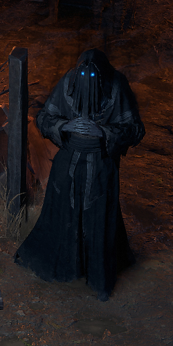
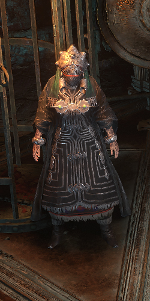
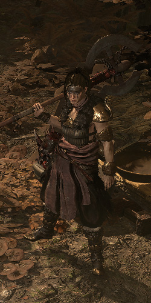

# Overview

## Video Guide

SoonTM

## Progression

The Interludes can be done in any Order, personal Preference is Ogham > Vastiri > Vaal.  
The  red Arrows are for the Ogham Progression.  
The  orange Arrows are for the First Part of the Vastiri Progression.  
The  blue Arrows are for the Second Part of the Vastiri Progression.  
The  yellow Arrows are for the Vaal Progression.

White / Black Text is required for Main Story Progression or Permanent Buffs.  
 Red Text marks Optional Tasks for additional Uncut Skill Gems or Uncut Support Gems, the Notes include the Reward.

Several Tasks in one Area can be completed in any Order, unless otherwise noted.

| Nr. | Zone                | To-Do                                                                                                  | Notes                                                                                                           |
| --- | ------------------- | ------------------------------------------------------------------------------------------------------ | --------------------------------------------------------------------------------------------------------------- |
| 1   | The Refuge          | Enter Scorched Farmlands                                                                               |                                                                                                                 |
| 2   | Scorched Farmlands  |  Loot the Corpse at the Checkpoint                                   | Drops a LvL 13 Uncut Skill Gem                                                                                  |
| 3   | Scorched Farmlands  | Kill Isolde of the White Shroud and Heldra of the Black Pyre                                           |                                                                                                                 |
| 4   | Scorched Farmlands  | Enter Stones of Serle                                                                                  |                                                                                                                 |
| 5   | Stones of Serle     | Activate all MEgaliths                                                                                 |                                                                                                                 |
| 6   | Stones of Serle     | Kill Siora, Blade of the Mists                                                                         |                                                                                                                 |
| 7   | Stones of Serle     | Summon and talk to Una. Then Return to Scorched Farmlands                                              | Checkpoint to Waypoint and WP to Scorched Farmlands                                                             |
| 8   | Scorched Farmlands  | Enter Blackwood                                                                                        |                                                                                                                 |
| 9   | Blackwood           |  Loot 2 Dark Omens                                                   | you can only Loot 2 Omens here                                                                                  |
| 10  | Blackwood           | Enter Holten                                                                                           |                                                                                                                 |
| 11  | Holten              |  Trade with the Ferryman                                             | Ferryman sells various Greater Runes                                                                            |
| 12  | Holten              | Enter Wolvenhold                                                                                       |                                                                                                                 |
| 13  | Wolvenhold          | Kill Oswin, the Dread Warden                                                                           | +2 Weapon Set & Passive Pooints                                                                                 |
| 14  | Wolvenhold          | Checkpoint to Entrance and return to Holten                                                            |                                                                                                                 |
| 15  | Holten              | Enter holten Estate                                                                                    |                                                                                                                 |
| 16  | Holten Estate       | Kill Lady Elswyth and Thane Wulfric                                                                    | Near the Entrance is a Door directly into the Boss Room                                                         |
| 17  | The Refuge          | Talk to the Hodded One and Travel to Vastiri                                                           |                                                                                                                 |
| 18  | Khari Bazaar        | Enter Khari Crossing                                                                                   |                                                                                                                 |
| 19  | Khari Crossing      | Kill Akthi, the final Sting and Anundr, the Sandworm                                                   |                                                                                                                 |
| 20  | Khari Crossing      | Enter the Skullmaw Stariway and Collect Molten One's Gift                                              | +5% Maximum Life Perm Buff                                                                                      |
| 21  | Khari Crossing      | Enter Pools of Khatal                                                                                  |                                                                                                                 |
| 22  | Pools of Khatal     | Enter Sel Khari Sanctuary                                                                              |                                                                                                                 |
| 23  | Sel Khari Sanctuary |  Collect Yoon's Barya and Rangeen's Barya (Drop from Random Enemies) |                                                                                                                 |
| 24  | Sel Khari Sanctuary |  Place Yoon's Barya and Claim Reward                                 | Rewards Rare Ring Selection, Rare Amulet Selection or Rare Ring Selection                                       |
| 25  | Sel Khari Sanctuary |  Place Rangeen's Barya and Claim Reward                              | Rewards Rare Ring Selection, Rare Amulet Selection or Rare Ring Selection, but cannot choose same as on Yoon's. |
| 26  | Sel Khari Sanctuary | Kill Elzarah, the Cobra Lord and talk to Jado                                                          |                                                                                                                 |
| 27  | Khari Bazaar        | Enter Khari Crossing                                                                                   | Take +2 Weapon Set & Passive Points from Risu                                                                   |
| 28  | Khari Crossing      | Enter Galai Gates                                                                                      |                                                                                                                 |
| 29  | Galai Gates         | Kiill Vornas, the Fell Flame and Enter Qimah                                                           |                                                                                                                 |
| 30  | Qimah               | Take Perm Buff from Orbala's Pillar                                                                    |                                                                                                                 |
| 31  | Qimah               | Enter Qimah Reservoir                                                                                  |                                                                                                                 |
| 32  | Qimah Reservoir     |  Kill Rare Bloodbilge                                                | Drops a LvL 14 Uncut Skill Gem                                                                                  |
| 33  | Qimah Reservoir     |  Collect Vial of Sacred Water and fill Sacred Well twice             | Drops 1 rare Currency like Vaal Orb or Exalted Orb. I do not recommend to go out of your way for this           |
| 34  | Qimah Reservoir     | Kill Azmadi, the Faridun Prince                                                                        |                                                                                                                 |
| 35  | Khari Bazaar        | Talk to the Hooded One and Travel to Vaal                                                              |                                                                                                                 |
| 36  | The Glade           | Talk to Doryani and enter Ashen Forest                                                                 |                                                                                                                 |
| 37  | Ashen Forest        |  Interact with Ancient Monument                                      | Drops a LvL 13 Uncut Skill Gem                                                                                  |
| 38  | Ashen Forest        | Enter Kriar Village                                                                                    |                                                                                                                 |
| 39  | Kriar Village       | Kill Lythara, The Wayward Spear and Collect Gemcrust Skull                                             | +40 Spirit and LvL 14 Uncut Spirit Gem                                                                          |
| 40  | Kriar Village       | Enter Glacial Tarn                                                                                     |                                                                                                                 |
| 41  | Glacial Tarn        |  Kill Essence at Checkpoint                                          |                                                                                                                 |
| 42  | Glacial Tarn        | Enter Howling Caves                                                                                    |                                                                                                                 |
| 43  | Howling Caves       | Kill Abominable Yeti and Collect Ice Tusks. Return to Glacial Tarn                                     |                                                                                                                 |
| 44  | Glacial Tarn        | Kill Rakkar, the Frozen Talon and Enter Kriar Peaks                                                    |                                                                                                                 |
| 45  | Kriar Peaks         |  Talk to Elder Madox and Take Random Unique                          | Acts as a One time Nameless Seer                                                                                |
| 46  | Kriar Peaks         | Enter Etched Ravine                                                                                    |                                                                                                                 |
| 47  | Etched Ravine       | Kill Stomrgore, the Guardian and Enter Cuachic Vault                                                   |                                                                                                                 |
| 48  | Cuachic Vault       |  Collect Small Soul Core and open Vaults                             | Contain several Magic Wall Chests                                                                               |
| 49  | Cuachic Vault       | Kill Zelina, Blood Priestess and Zolin, Blood Priest                                                   |                                                                                                                 |
| 50  | Cuachic Vault       | Talk to Doryani                                                                                        |
| 51  | The Glade           | Collect Reward from Hilda and travel to Kingsmarch in Act 4                                            | +2 Weapon Set & Passive Points                                                                                  |
| 52  | Kingsmarch          | Collect Reward from Hooded one                                                                         | +2 Weapon Set & Passive Points                                                                                  |
| 53  | Kingsmarch          | Talk to Doryani and Travel to Endgame                                                                  |                                                                                                                 |

## League Mechanic Rewards

Started with Abyss the current League Mechanic gave guranteed Rewards when doing the in-zone Mechanic. These Rewards are only guranteed once and help smooth out the Campaign Progression a lot.

So in Fate of the Vaal, the Vaal Charge Platforms dropped these when clearing all Monsters, or in Abyss these Rewards were guranteed when the Last Abyss spawned a Chest. This is not a gurantee going forward, but it is good to know.

Recommended ones are great to collect if they are on teh way, force ones ae really good to spend some extra time in the zone to find.

### Interlude Ezomite

| Zone               | Reward                       | Notes       |
| ------------------ | ---------------------------- | ----------- |
| Scorched Farmlands | LvL 4 Support Gem            | Recommended |
| Stone of Serle     | Exalted Orb                  | Recommended |
| Blackwood          | Greater Orb of Transmutation |             |
| Holten             | Random Greater Rune          |             |
| Wolvenhold         | Greater Orb of Augmentation  |             |
| Holten Estate      | Artificer's Orb              |             |

### Interlude Maraketh

| Zone                | Reward                       | Notes       |
| ------------------- | ---------------------------- | ----------- |
| Khari Crossing      | Gemcutter's Prism            | Recommended |
| Pools of Khatal     | Orb of Alcehmy               |             |
| Sel Khari Sanctuary | Orb of Chance                | Recommended |
| Galai Gates         | Greater Orb of Augmentation  |             |
| Qimah               | Exalted Orb                  | Recommended |
| Qimah Reservoir     | Greater Orb of Transmutation |             |

### Interlude Vaal

| Zone          | Reward                       | Notes                              |
| ------------- | ---------------------------- | ---------------------------------- |
| Ashen Forest  | Rare Belt                    | Recommended, force if Belt is weak |
| Kriar Village | Random Greater Rune          |                                    |
| Glacial Tarn  | Greater Orb of Augmentation  |                                    |
| Howling Caves | Chaos Orb                    | Recommended                        |
| Kriar Peaks   | Greater Orb of Transmutation |                                    |
| Etched Ravine | Exalted Orb                  | Recommended                        |
| Cuachic Vault | Vaal Orb                     |                                    |

### Town NPCs

| Hooded One                                             | Risu                                   | Hilda                                         |
| ------------------------------------------------------ | -------------------------------------- | --------------------------------------------- |
|  |  |  |
| Access to Travel between the Interludes                | Quest Reward                           | Quest Reward                                  |
