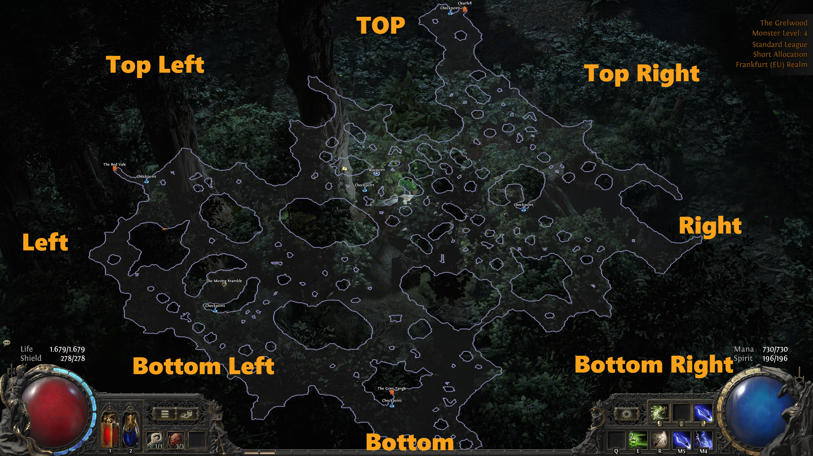
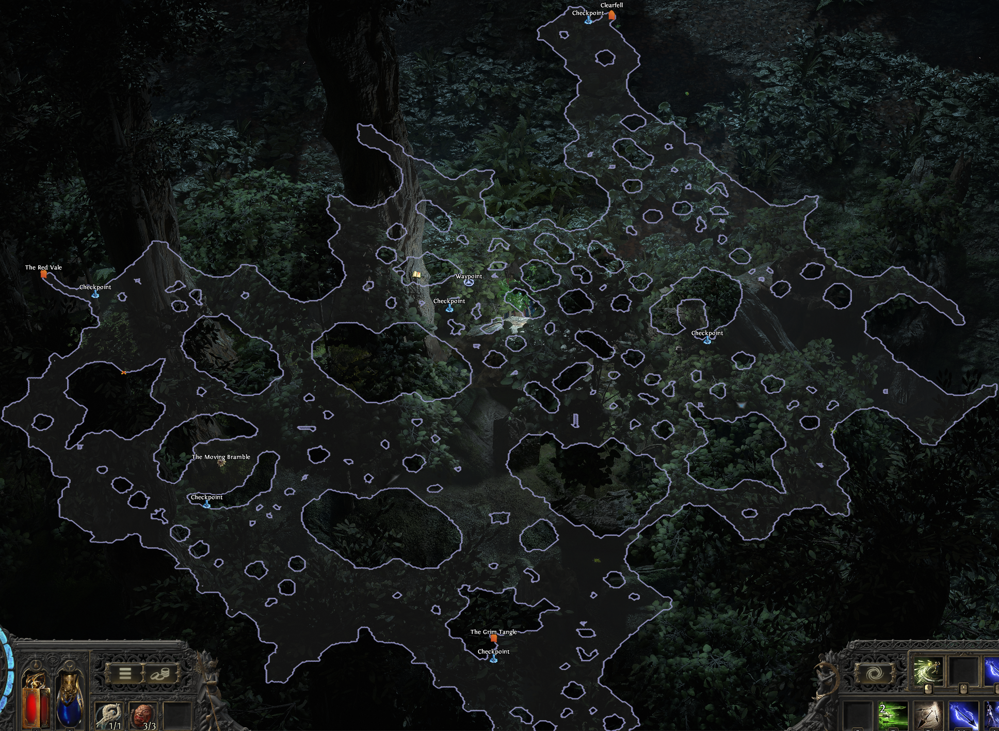

# Cyclon’s Advanced Campaign Guide V0.1

Welcome to my advanced Campaign Guide for Path of Exile 2, this Guide is meant for the 2nd+ Campaign Playthrough.
For your first Playthrough I highly recommend to go at your own pace and explore everything.
**You only have 1 first playthrough!**

This guide is not perfect, it is meant to help reach a 7 to 8 hour campaign time.
Just reading through this without practising won't result in major time saves.
If you have any questions or anything is unclear, reach out to me on
[YouTube](https://www.youtube.com/@CyclonDefinitiv), [Discord](https://discord.gg/EvJhCTgpnD) or [Twitch](https://www.twitch.tv/cyclondefinitiv)

## For who this is intended

I highly recommend this to anyone that wants to reduce their Campaign Time and is willing to spend a couple hours learning Layout Identifiers, Enviromental Clues and general Layout Rules.
If you want very generic simplified Layout Explanations I recommend [Lolcohols Layout Mobalytic Guide](https://mobalytics.gg/poe-2/guides/campaign-layout-act-1). My guide is more complex, but more indepth and considers the rotating Layouts between Leagues.  
That said, this guide is not indepth enough to make you a speedrunner, that will require even more indepth layout knowledge and studying.

The Guide will have 3 Steps of Learning:

- A simple Read, that is by no means perfect, trying to cover as many cases as possible.
- A more detailed Flowchart Approach, covering all Variants and Special Cases (at least known ones)
- A Table of Layouts with indicators how to run them, for those that want to learn all Layout Variants.

## Zone Generation

Most Zones in Path of Exile 2 are procedural generated. This means that the zone is made up of several tiles and will generate a Layout Variant based on a random seed. This seed is defined as the League starts or Private League is created.  
The Zones have specific Enviromental Objects or Points of Interest that require specific conditions to be created. By generating several Instances of a Zone and comparing the Minimaps we can learn the Rules a Zone follows and can learn a generic Way to read those independed of the world seed.

Some Zones have set Layouts due to having strict rules they have to follow and will only differ in minor ways. Those I call Static Layouts. As every Point of Interest will always be in the same Spot.

## How to orient the zone

## How to help

If you want to help filling out this Document please contact me via Discord.

### Missing Layout

Please take a Screenshot of the fully discovered Minimap and send it to me via Discord

Example:

### Better Explanation

If you found a better Explanation how to identify and read a Zone, got any Comments or Notes for outliers / simple Reads please send me it me via Discord.

Example:  
Act 1 - Grellwood  
`Better Explanation: [Explanation]` or  
`Simple Read: [Explanation]`
